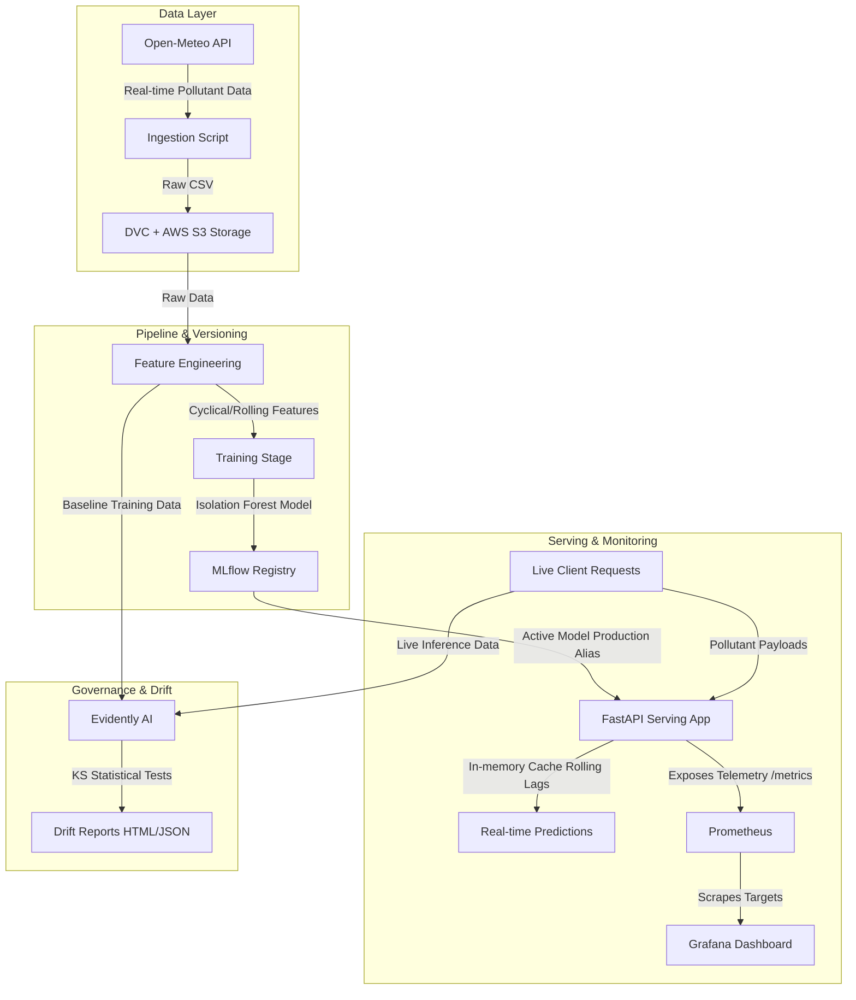

# 🚀 Real-Time AQI Anomaly Detection Platform — MLOps Pipeline

An end-to-end MLOps pipeline designed to ingest air quality telemetry, detect multivariate sensor anomalies using unsupervised machine learning, and manage the full model lifecycle with reproducibility, continuous monitoring, and automated infrastructure provisioning.

---

## 🏗️ System Architecture



---

## 🌟 Key Features

*   **Robust Data Engineering & Ingestion**: Fetches multivariate pollutant timeseries data (PM2.5, PM10, $\text{NO}_2$, $\text{SO}_2$, $\text{CO}$) automatically from the Open-Meteo Air Quality API for major cities (Chennai, Bangalore, Delhi).
*   **Unsupervised Machine Learning**: Utilizes an **Isolation Forest** model to flag outlier pollutant levels and identify environmental anomalies without labeled datasets.
*   **Pipeline Reproducibility (DVC)**: Tracks datasets and models via **Data Version Control (DVC)** backed by **AWS S3** storage, declaring a strict execution DAG (`dvc.yaml`).
*   **Experimentation Tracker (MLflow)**: Logs parameters, hyperparameters (contamination rate, estimators), metrics, and registers production model assets in the MLflow Model Registry.
*   **Low-latency Serving (FastAPI)**: Serves prediction payloads through FastAPI validated via **Pydantic** models, using an in-memory history cache to dynamically compute lag and rolling features on-the-fly.
*   **Observability (Prometheus & Grafana)**: Tracks system health, query latencies, and anomaly detection frequencies via custom metrics pulled into live Grafana dashboards.
*   **Data Drift Audit (Evidently AI)**: Compares baseline training sets with live inference distributions using Kolmogorov-Smirnov statistical tests to detect feature drift.
*   **Infrastructure as Code (Terraform)**: Provisions secure AWS EC2 deployment servers and S3 storage buckets with self-bootstrapping Docker Compose configurations.
*   **Continuous Integration (GitHub Actions)**: Automated workflow to run formatting/lint checks (`ruff`) and unit tests (`pytest`) on code changes.

---

## 📁 Repository Structure

```text
├── .dvc/                   # Data Version Control configuration files
├── .github/workflows/      # CI/CD pipelines (GitHub Actions)
├── config/                 # Grafana and system dashboard configurations
├── data/
│   ├── raw/                # Ingested raw datasets (Git-ignored, DVC-tracked)
│   └── processed/          # Processed features (Git-ignored, DVC-tracked)
├── models/                 # Model artifacts (.joblib) (Git-ignored, DVC-tracked)
├── reports/                # Evidently AI drift analysis HTML and JSON reports
├── src/
│   ├── api/                # FastAPI application & sliding cache features
│   ├── components/         # Ingestion, feature engineering, and training modules
│   └── monitoring/         # Evidently AI statistical drift evaluation
├── terraform/              # AWS EC2 & S3 provisioning configuration files
├── tests/                  # API and pipeline unit tests (Pytest)
├── docker-compose.yml      # Local multi-service composition file
├── Dockerfile              # Multi-stage optimized Docker build config
├── dvc.yaml                # DVC execution pipeline steps
├── params.yaml             # Model hyperparameters definitions
└── requirements.txt        # Production python packages checklist
```

---

## 🚀 Getting Started

### 1. Local Setup

Make sure you have python 3.10+ installed.

```bash
# Clone the repository
git clone https://github.com/sri-mathi/MLOps.git
cd MLOps

# Create and activate virtual environment
python -o venv venv
source venv/bin/activate

# Install dependencies
pip install -r requirements.txt
```

### 2. Running the MLOps Pipeline

To execute the data lifecycle stages (Ingestion -> Feature Engineering -> Training):

```bash
# Ingest data, engineer features, and train the model via DVC
dvc repro
```

This will output the trained Isolation Forest model directly to the `models/` directory.

To spin up the MLflow Tracking UI to view logs:

```bash
mlflow ui --backend-store-uri sqlite:///mlflow.db --port 5050
```
Open **[http://localhost:5050](http://localhost:5050)** in your browser to inspect model runs and metrics.

### 3. Running Data Drift Analysis

Evaluate whether your current features have statistical covariate shifts compared to training data:

```bash
python src/monitoring/drift_detection.py
```
This writes visual reports to `reports/drift_report.html` and structured statistics to `reports/drift_report.json`.

---

## 🐳 Docker Orchestration

You can spin up the entire serving stack, metrics aggregators, and dashboard views locally using a single command:

```bash
docker-compose up --build -d
```

### Active Services Map

| Service | Port (Host:Container) | Description | URL |
| :--- | :--- | :--- | :--- |
| **FastAPI App** | `8001:8000` | Prediction & Health endpoints | [http://localhost:8001/docs](http://localhost:8001/docs) |
| **MLflow UI** | `5050:5050` | Models, parameters, and runs tracker | [http://localhost:5050](http://localhost:5050) |
| **Prometheus** | `9090:9090` | Time-series scraper scraping `/metrics` | [http://localhost:9090](http://localhost:9090) |
| **Grafana** | `3002:3000` | Dashboard showing API stats & anomalies | [http://localhost:3002](http://localhost:3002) |

---

## 🛠️ Infrastructure Provisioning (Terraform)

An AWS EC2 server and S3 bucket configured for DVC storage can be built automatically.

1. Ensure you have the AWS CLI configured with proper permissions.
2. Initialize and deploy:

```bash
cd terraform
terraform init
terraform plan
terraform apply -auto-approve
```

The startup script on the EC2 instance automatically installs Docker, Docker Compose, clones the codebase, and spins up the containerized architecture.

---

## 🧪 Testing & Linting

Unit tests are written using `pytest` and can be run locally:

```bash
# Run unit tests
pytest

# Run code style/quality analysis
ruff check .
```
